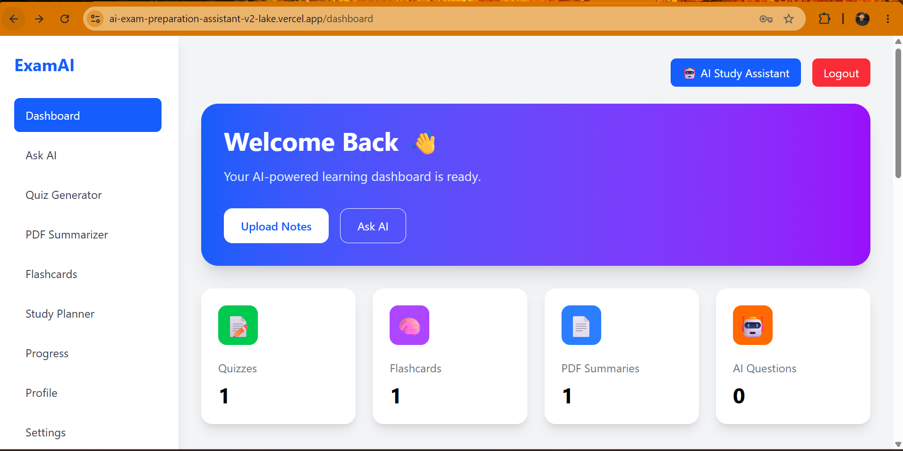
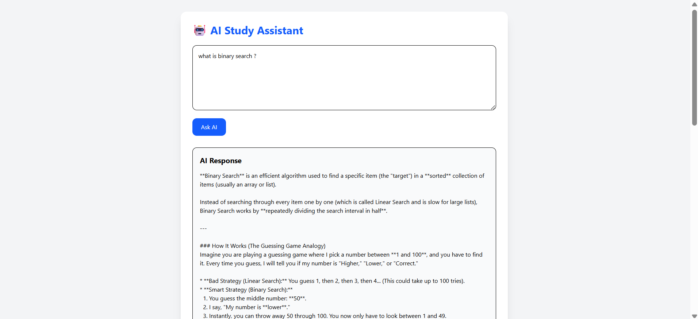
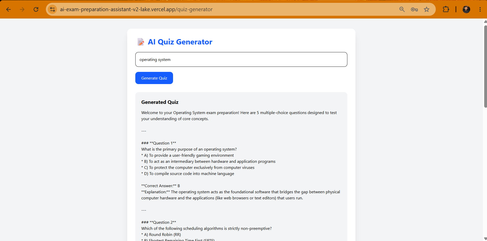
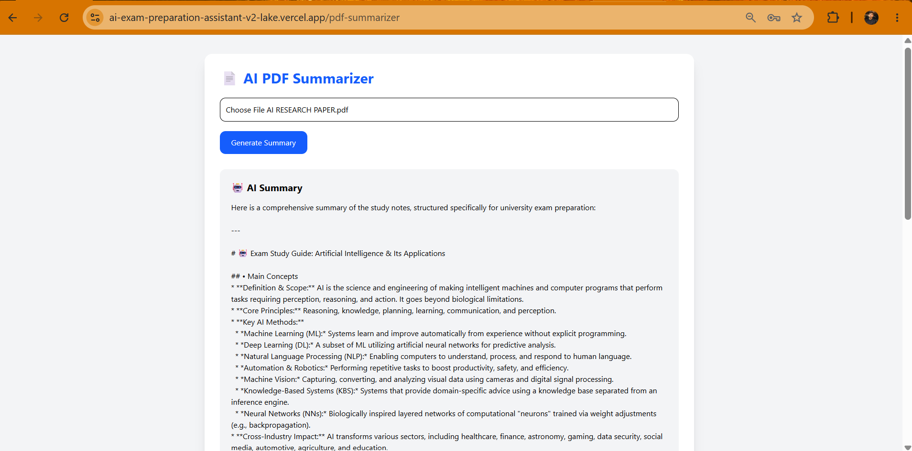
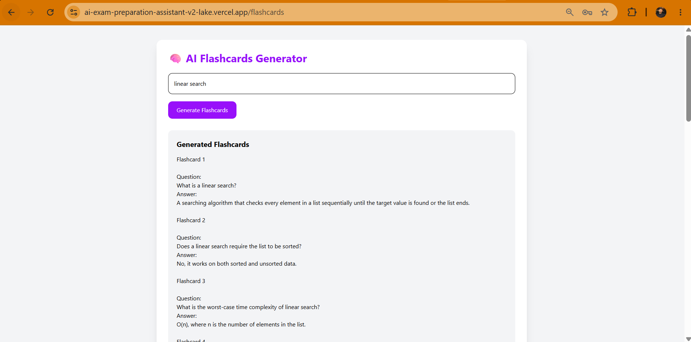
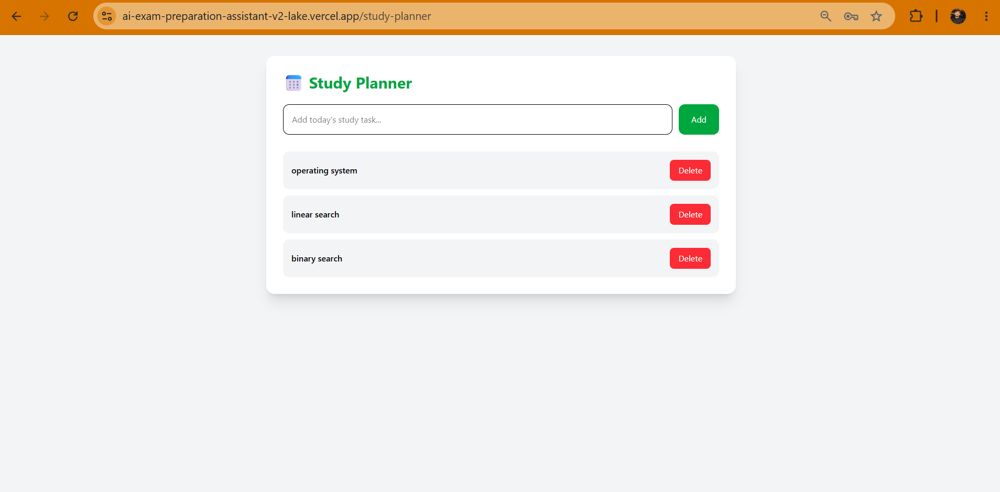

# 🎓 AI Exam Preparation Assistant

An AI-powered web application that helps university students prepare for exams using Google's Gemini AI.

---

# 📚 Problem It Solves

University students often spend a lot of time creating quizzes, summarizing notes, preparing flashcards, and asking study-related questions. This application combines all of these tools into one platform, making exam preparation faster, easier, and more organized.

---

# 🚀 Live Demo

https://ai-exam-preparation-assistant-v2-lake.vercel.app

---

# 📂 GitHub Repository

https://github.com/aa50972006-byte/ai-exam-preparation-assistant-v2

---

# ✨ Features

- 🤖 AI Study Assistant
- 📝 AI Quiz Generator
- 📄 AI PDF Summarizer
- 🧠 AI Flashcards Generator
- 📅 Study Planner
- 📊 Progress Dashboard
- 👤 User Profile
- 📥 Export AI responses as PDF
- 🔐 Firebase Authentication
- ☁️ Cloud Firestore Database

---

# 🤖 AI Feature

The application uses Google's Gemini AI to help students study.

### AI can:

- Answer study questions
- Generate quizzes
- Summarize PDF notes
- Create flashcards

### Prompt Example

```
You are an AI Exam Preparation Assistant.

Provide clear, accurate, and easy-to-understand answers for university students.

Explain concepts simply and focus on exam preparation.
```

---

# 🛠 Tools & Technologies

- React.js
- Vite
- Tailwind CSS
- Firebase Authentication
- Cloud Firestore
- Google Gemini API
- PDF.js
- jsPDF
- Vercel
- Git & GitHub

---

# 📸 Screenshots

### Dashboard



### AI Study Assistant



### Quiz Generator



### PDF Summarizer



### Flashcards



---

# ▶️ How to Run the Project

Clone the repository

```bash
git clone https://github.com/aa50972006-byte/ai-exam-preparation-assistant-v2.git
```

Install dependencies

```bash
npm install
```

Run the development server

```bash
npm run dev
```

Build for production

```bash
npm run build
```

---

# 👨‍💻 Author

**Ahmad Hassan**

## 📸 Screenshots

### Dashboard


### AI Study Assistant


### Quiz Generator


### PDF Summarizer


### Flashcards


### Study Planner

